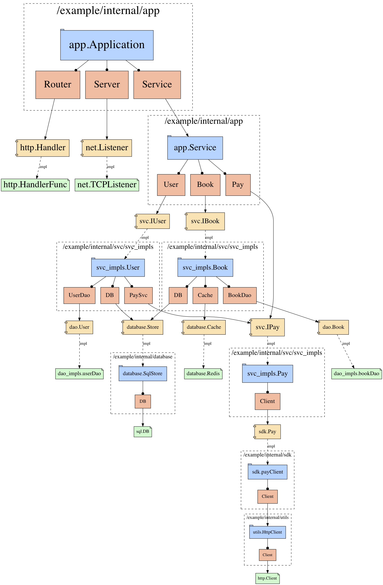

# Go Struct Graph
> generate struct relation graph of your application

## Mentions

- [graphviz](http://www.graphviz.org)
- [awalterschulze/gographviz](github.com/awalterschulze/gographviz)


## Usage example

```go
func MakeApplication() Application {
	listener, err := net.Listen("tcp", ":8080")
	if err != nil {
		panic(err)
	}
	src := fmt.Sprintf("%s:%s@tcp(%s:%d)/%s", "root", "Aa123456", "0.0.0.0", 3306, "mysql")
	sqlDB, err := sql.Open("mysql", src)
	if err != nil {
		panic(err)
	}
	db := &database.SqlStore{DB: sqlDB}
	a := app.Application{
		Server: listener,
		Service: app.Service{
			User: &svc_impls.User{
				UserDao: dao_impls.NewUserDao(),
				DB:      db,
			},
			Book: &svc_impls.Book{
				BookDao: dao_impls.NewBookDao(),
				DB:      db,
			},
			Pay: &svc_impls.Pay{Client: sdk.NewPayClient()},
		},
	}
	return a
}

func Draw() {
	app := MakeApplication()
	ret := structgraph.Draw(app)

}
```

draw ret with graphviz `dot`


